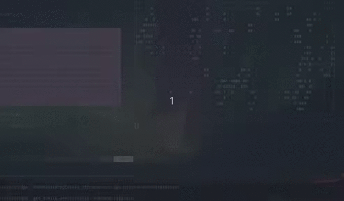
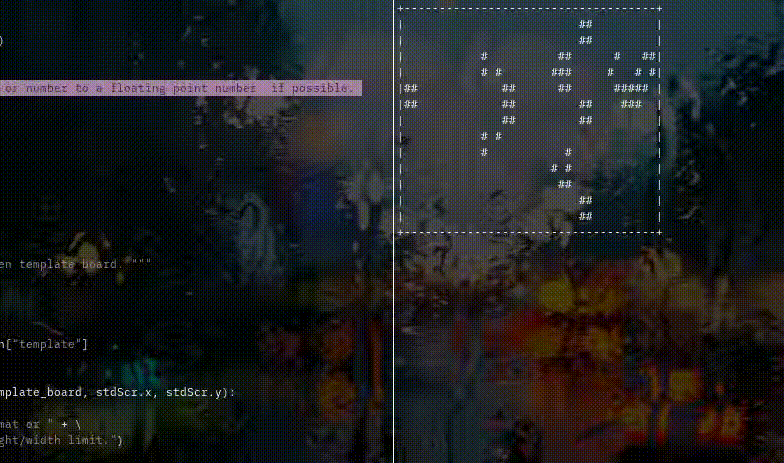

golife : Conway's Game of Life
==============================

Introduction
------------

Here is a brief description of **Conway's [Game of Life][]** from Wikipedia:

> The **Game of Life**, also known simply as **Life**, is a cellular automaton devised
> by the British mathematician John Horton Conway in 1970. It is a zero-player
> game, meaning that its evolution is determined by its initial state,
> requiring no further input. One interacts with the Game of Life by creating
> an initial configuration and observing how it evolves. It is Turing complete
> and can simulate a universal constructor or any other Turing machine.

It is one of more intersting topics not only in Computer Science but also
within the programming community - for it is facinating to observe how little
deviation in the initial condition can propagate and disrupt the entire system.

This project is a self-interest driven study project focused on creating the
simulation environment for _Game of Life_ in Python3.

How To Run golife
-----------------

_The basic usage is covered with `python golife.py -h`_.

The application runs in three "modes" - "random", "template" and "gif":

**Random Mode**:

`python golife.py random`

_Random_ mode is as the name implies simulates the game of life with the
randomized starting template. It uses `curses` to display the board onto the
terminal, and it can be terminated at anytime with `CRTL + C`. If the provided
`WIDTH` and `HEIGHT` parameters exceed the current window size, then it will
default to the safe value of 10.

**Template Mode**:

`python golife.py template --path "path-to-template-file"`

_Template_ mode takes in a template JSON file where the template board is
defined as 2-D array of 0s and 1s as `--path` option varaible. It then runs the
simulation based on the initial states as specified by the template given. Few
sample templates are available in the `/resources` directory. For example, you
can try the Gospher's Glider Gun template with `python3 golife.py template
--path "resources/gospher_glider_gun.json"`.

**GIF Mode**:

`python golife.py gif`

<TODO>

TODO
----

- Give project a better structure.
- Finish template mode (in prototype).
- Finish .gif export mode.
- Robust error detection for curses and max window sizes.

Contacts
--------

Author's homepage is <http://jiinmoon.com>.

My email is [jmoon@tutanota.com](mailto::jmoon@jiinmoon.com).

I am also available at
[#jmoon:matrix.org](https://matrix.to/#/!oXEFoxrdcJbExYsHWu:matrix.org?via=matrix.org).

Sources
-------

A single Gosper's glider gun creating gliders image was used under terms of GNU
Free Documentation License.

[Game of Life]: https://en.wikipedia.org/wiki/Conway%27s_Game_of_Life "Wikipedia: Game of Life"
